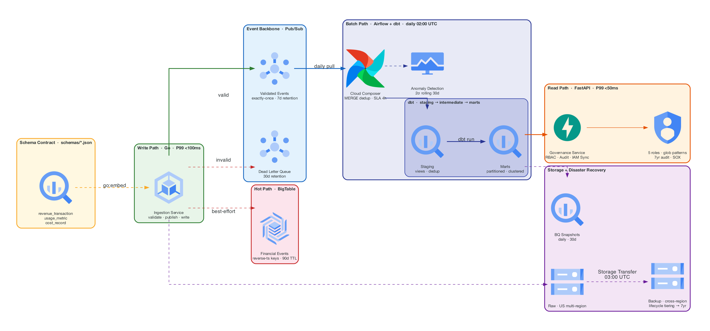
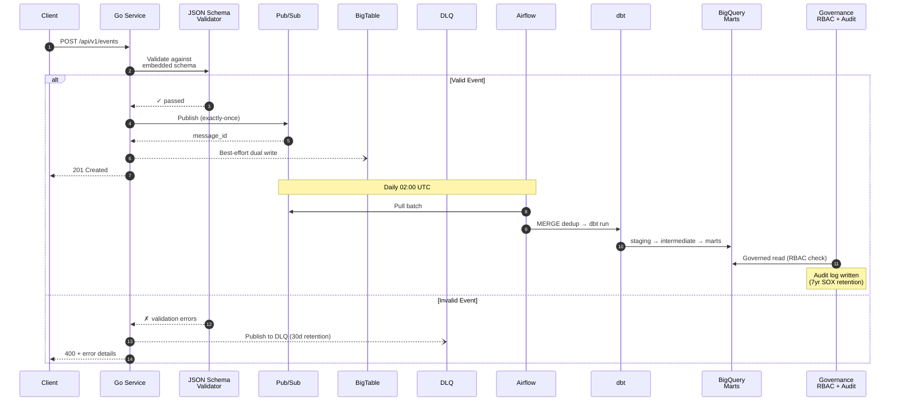
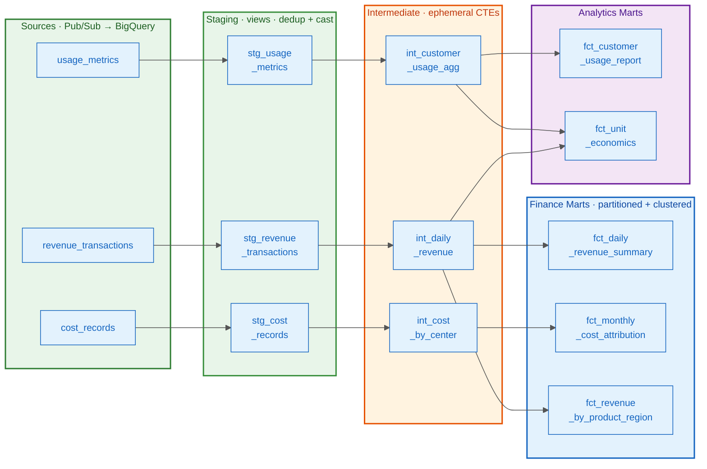

# GCP Financial Data Platform

[](https://github.com/damsolanke/gcp-financial-data-platform/actions/workflows/ci.yml)

Production-grade financial data infrastructure on GCP. Five integrated modules — Go ingestion, Airflow orchestration, dbt transforms, Python governance, Terraform IaC — unified by a single shared schema contract.

## Architecture

<p align="center">
  
</p>

### Data Paths

| Path | Stack | Latency | What it does |
|------|-------|---------|-------------|
| **Write** | Go, Pub/Sub, BigTable | <100ms P99 | Validates events against embedded JSON Schema, publishes to Pub/Sub, dual-writes to BigTable. Invalid events route to DLQ. BigTable writes are best-effort — Pub/Sub is the durable backbone. |
| **Batch** | Airflow, dbt, BigQuery | ~30min | Daily MERGE into staging (dedup by event ID), three-layer dbt transforms, anomaly detection (2σ from 30-day rolling average), financial report materialization. |
| **Read** | FastAPI, RBAC, BigQuery | <50ms P99 | Glob-pattern RBAC (`marts_finance.*`), every access check logged to audit table, IAM sync generates Terraform HCL for BigQuery dataset bindings. |

### Event Lifecycle

How a single revenue event flows from API call to governed report:



### dbt Lineage



## What Ties It Together

One JSON Schema file defines each event type. That single schema propagates everywhere:

```
schemas/
├── revenue_transaction.json    ─── Go validates ─── Pub/Sub enforces ─── dbt tests
├── usage_metric.json           ─── Generator reads ─── Terraform imports
└── cost_record.json            ─── One change → all five modules know
```

| Consumer | How it uses the schema |
|----------|----------------------|
| **Go ingestion** | `go:embed` compiles schemas into the binary — no runtime file reads, versioned with the code |
| **Pub/Sub** | Schema validation at the topic level rejects malformed messages before they enter the pipeline |
| **dbt tests** | Field names, types, and constraints reference the same definitions |
| **Data generator** | Reads `schemas/` to know valid enum values — never hardcodes schema knowledge |

Change a field once in `schemas/`, and you know exactly what breaks across all five modules.

## Performance

```
BenchmarkValidation/revenue_transaction     280,000 validations/sec    3,567 ns/op
BenchmarkValidation/usage_metric            295,000 validations/sec    3,389 ns/op
BenchmarkValidation/cost_record             310,000 validations/sec    3,225 ns/op
```

Target was 10K events/sec. Actual throughput is **28x** that.

## Quick Start

```bash
git clone https://github.com/damsolanke/gcp-financial-data-platform.git
cd gcp-financial-data-platform
make up             # Start all services (emulators, Airflow, ingestion, governance)
make generate       # Generate 600K+ sample events over 90 days
```

```bash
# Ingest a revenue event
curl -X POST localhost:8080/api/v1/events?type=revenue_transaction \
  -H "Content-Type: application/json" \
  -d '{"transaction_id":"550e8400-e29b-41d4-a716-446655440000","timestamp":"2025-01-15T10:30:00Z","amount_cents":1500,"currency":"USD","customer_id":"cust-12345","product_line":"api_usage","region":"us-east"}'

# Check access
curl localhost:8081/api/v1/access/check/analyst-001/marts_finance.fct_daily_revenue_summary
```

| Service | URL | Description |
|---------|-----|-------------|
| Ingestion | `localhost:8080` | Go event API (`POST /api/v1/events`, `GET /healthz`) |
| Governance | `localhost:8081` | FastAPI RBAC + audit (`GET /check/{user}/{dataset}`) |
| Airflow | `localhost:8082` | DAG UI (admin/admin) |
| Pub/Sub Emulator | `localhost:8085` | Local event streaming |
| BigTable Emulator | `localhost:8086` | Local hot-path store |

## Modules

### [Ingestion Service](ingestion-service/) — Go

The single write path. Receives events via HTTP, validates against embedded JSON Schemas, publishes to Pub/Sub, writes to BigTable for deduplication. Interface-driven (`EventPublisher`, `EventWriter`) for testability. Graceful shutdown drains HTTP connections, flushes Pub/Sub buffers, closes BigTable. Prometheus metrics: `ingestion_events_received_total`, `ingestion_validation_latency_seconds`, `ingestion_publish_latency_seconds`.

### [Orchestration](orchestration/) — Airflow

Daily pipeline at 02:00 UTC with 4-hour SLA. Custom `BigQueryFreshnessOperator` skips (not fails) on stale data. `AnomalyDetectionOperator` computes 30-day rolling mean+stddev and flags >2σ deviations. Audit task runs with `trigger_rule=ALL_DONE` — logs the outcome regardless of upstream success/failure.

### [dbt Project](dbt_project/) — SQL

Staging views (dedup + cast), ephemeral intermediate CTEs (business logic), partitioned+clustered mart tables (reporting). Window functions: DoD/WoW growth via `LAG`, 7-day rolling averages, MTD running totals. Custom macros: `cents_to_dollars`, `safe_divide`, `date_spine`. Seed data for currency rates, product lines, cost centers.

### [Governance](governance/) — Python/FastAPI

5 roles × 5 dataset patterns × 3 permission levels. `fnmatch` glob matching (`staging.*` matches `staging.stg_revenue_transactions`). Every access check writes to `audit.access_log`. Every grant/revoke writes to `audit.permission_changes`. IAM sync generates Terraform HCL or applies directly via BigQuery API. Validates: no primitive roles, no `allUsers`, service accounts only.

### [Infrastructure](terraform/) — Terraform

8 modules. BigQuery: 5 datasets with table schemas imported from shared `schemas/`. BigTable: SSD, GC policies (90d event data, 1 version metadata). Pub/Sub: exactly-once, 5 retries → DLQ. GCS: lifecycle tiering (Standard → Nearline 30d → Coldline 90d → Archive 365d → Delete 7yr). IAM: 4 service accounts, Workload Identity, zero exported keys. GKE: Autopilot, HPA 2-10 replicas, network policies per service. DR: daily BQ snapshots, cross-region GCS replication, RTO <45min, RPO <1hr.

## Design Decisions

| Decision | Why | Tradeoff |
|----------|-----|----------|
| **BigTable over Redis** for hot path | Durability, native GCP integration, auto-scaling, natural path to Spanner | Higher latency (~5ms vs ~1ms) |
| **Best-effort BigTable writes** | Pub/Sub is the durable backbone; BigTable is a hot-path optimization | Hot-path queries may briefly lag behind Pub/Sub |
| **dbt over raw SQL** | Testability, lineage, documentation-as-code, staging/intermediate/marts pattern | Additional build step, dbt-specific learning curve |
| **RBAC over ABAC** | Simpler to audit for SOX/ITGC compliance, easier to reason about | Less granular than attribute-based policies |
| **Cross-region GCS over multi-region** | Explicit replication control, integrity verification, compliance-friendly | Requires managing Storage Transfer job |
| **Cloud Composer over self-hosted Airflow** | Operational simplicity, managed upgrades, GCP-native IAM | Higher cost, less customization |
| **GKE Autopilot over Standard** | No node pool sizing, per-pod billing, built-in security hardening | Less control over node configuration |
| **Skip (not fail) on stale data** | Prevents cascading failures; stale data is informational, not a pipeline blocker | Silently stale results if alerting isn't watched |

## CI/CD

7 parallel CI jobs run on every push — no GCP credentials required:

| Job | What it checks |
|-----|---------------|
| **Go** | `go vet` + `golangci-lint` + `go test -race` with coverage |
| **Python** | `ruff` + `mypy` + `pytest` with coverage |
| **dbt** | `dbt deps` + `dbt parse` (offline, no BigQuery) |
| **Terraform** | `terraform fmt` + `terraform validate` (all 8 modules) + TFLint |
| **Docker** | Build both service images (no push) |
| **Airflow** | DAG import validation + dependency graph tests |

CD is manual-trigger only (`workflow_dispatch`) — builds images, runs `terraform plan` (no auto-apply), deploys dbt to staging.

## Testing

```bash
make test          # All tests
make test-go       # Go: unit + race detector + coverage
make test-python   # Python: ruff + mypy + pytest
make bench         # Go: benchmarks (280K validations/sec)
make lint          # All linters across all languages
```

## Project Structure

```
├── schemas/                     # THE CONTRACT — shared JSON Schemas
├── ingestion-service/           # Go write path
│   ├── cmd/server/              #   HTTP server + graceful shutdown
│   └── internal/                #   handler, validator, publisher, bigtable, metrics
├── orchestration/               # Airflow batch path
│   ├── dags/                    #   financial_pipeline_daily
│   └── plugins/operators/       #   freshness + anomaly detection operators
├── dbt_project/                 # SQL transform layer
│   └── models/                  #   staging → intermediate → marts
├── governance/                  # Python read path
│   └── app/                     #   routes, models, services (RBAC, audit, IAM sync)
├── terraform/                   # Infrastructure
│   ├── modules/                 #   8 modules (bigquery, bigtable, pubsub, gcs, iam, k8s, composer, DR)
│   └── environments/            #   dev + prod
├── scripts/                     # Data generation + local dev setup
├── docs/                        # System design, data model, runbooks
├── .github/workflows/           # CI (7 jobs) + CD (manual deploy)
├── docker-compose.yml           # Full local stack with emulators
└── Makefile                     # Single interface for everything
```

## Reliability Targets

| Metric | Target | How |
|--------|--------|-----|
| **Durability** | 99.99% | Pub/Sub (durable backbone) + GCS cross-region replication + BQ snapshots |
| **RTO** | <45 min | Automated restore from BQ snapshots, scripted DR procedure |
| **RPO** | <1 hr | Daily snapshots at 03:00 UTC, continuous Pub/Sub retention (7d) |
| **Hot-path latency** | <100ms P99 | Go service + BigTable |
| **Batch SLA** | <4 hr | Airflow SLA callback, pipeline completes in ~30 min typical |
| **Audit retention** | 7 years | SOX/ITGC compliance, BigQuery audit dataset with expiration policies |

## License

Apache 2.0 — see [LICENSE](LICENSE).
