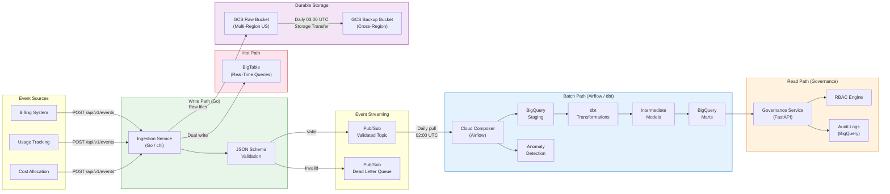

# GCP Financial Data Platform

Production-grade financial data infrastructure platform on GCP demonstrating data pipelines, governance, storage reliability, and access control at scale.

## Architecture



**Three distinct data paths:**

| Path | Technology | Latency | Purpose |
|------|-----------|---------|---------|
| **Write** | Go + Pub/Sub + BigTable | <100ms | Real-time event ingestion and validation |
| **Batch** | Airflow + dbt + BigQuery | <30min | Daily transformations and reporting |
| **Read** | FastAPI + RBAC + Audit | <50ms | Access-controlled queries with full audit trail |

## Tech Stack

| Technology | Purpose | Module |
|------------|---------|--------|
| Go | Event ingestion service | A |
| Python / FastAPI | Governance and access control | D |
| BigQuery | Data warehouse, analytics | B, C, D |
| BigTable | Hot-path low-latency store | A |
| Pub/Sub | Event streaming backbone | A, B |
| Airflow (Cloud Composer) | Pipeline orchestration | B |
| dbt | SQL transformations and testing | C |
| Terraform | Infrastructure-as-Code | E |
| GCS | Object storage, backup | E |
| GKE | Container orchestration | E |
| Prometheus | Metrics and monitoring | A |
| Docker | Containerization | All |
| GitHub Actions | CI/CD | All |

## Quick Start

```bash
git clone https://github.com/adesolanke/gcp-financial-data-platform.git
cd gcp-financial-data-platform
make up            # Start all services with docker-compose
make generate      # Generate sample financial data
curl localhost:8080/api/v1/events -d @data/sample_event.json  # Ingest an event
curl localhost:8081/api/v1/access/check/analyst-001/marts_finance.fct_daily_revenue_summary  # Check access
```

**Local services after `make up`:**

| Service | URL | Description |
|---------|-----|-------------|
| Ingestion Service | `localhost:8080` | Go event ingestion API |
| Governance Service | `localhost:8081` | FastAPI access control and audit |
| Airflow Webserver | `localhost:8082` | DAG management UI |
| Pub/Sub Emulator | `localhost:8085` | Local Pub/Sub for development |
| BigTable Emulator | `localhost:8086` | Local BigTable for development |

## Modules

### A. [Ingestion Service](ingestion-service/) (Go)

High-throughput event ingestion with schema validation, dual-write to Pub/Sub and BigTable, dead-letter queue for invalid events, and Prometheus metrics. Handles graceful shutdown with in-flight request draining, Pub/Sub flush, and BigTable connection cleanup.

### B. [Orchestration](orchestration/) (Airflow)

Daily batch pipeline (`financial_pipeline_daily`) running at 02:00 UTC with 4-hour SLA. Task chain: freshness check, staging load (MERGE for deduplication), dbt transforms, dbt tests, financial reports, anomaly detection, and audit logging. Custom operators for BigQuery freshness monitoring and statistical anomaly detection.

### C. [dbt Project](dbt_project/) (SQL)

Three-layer transformation model (staging, intermediate, marts) with 5 fact tables, 3 custom macros, referential integrity tests, and seed data for currency exchange rates, product line mapping, and cost center hierarchy. BigQuery-optimized with date partitioning and clustering.

### D. [Governance Service](governance/) (Python/FastAPI)

RBAC-based access control with 5 roles (admin, finance_analyst, data_engineer, executive, auditor), glob-pattern dataset matching, complete audit logging of every access check and permission change, and IAM sync to generate Terraform HCL or direct GCP API bindings.

### E. [Infrastructure](terraform/) (Terraform)

7 Terraform modules: BigQuery, BigTable, Pub/Sub, GCS (dual-bucket with lifecycle tiering), IAM (least privilege, Workload Identity), Kubernetes (GKE Autopilot), Cloud Composer, and Disaster Recovery (dataset snapshots, monthly DR tests). Separate dev/prod environments.

## Design Decisions

### BigTable for hot path (vs Redis)

Chose BigTable for durability guarantees, native GCP integration, and automatic scaling. Redis would be faster but requires separate replication and persistence management. At scale, BigTable's built-in replication and consistent performance under load is worth the latency tradeoff. BigTable also provides a natural path to Spanner if we need global consistency later.

### dbt over raw SQL

Testability, built-in documentation, and lineage tracking. dbt models serve as both transformation logic AND documentation of the data model. Every business rule is version-controlled, tested, and documented in one place. The staging/intermediate/marts pattern enforces separation of concerns -- staging handles deduplication and type casting, intermediate handles business logic, marts handle reporting aggregations.

### RBAC over ABAC

Simpler to implement, audit, and reason about. ABAC is the logical next step when we need attribute-based conditions (time-of-day restrictions, IP-based access, data classification levels). Starting with RBAC means the permission model is easy to explain in compliance audits. The glob-pattern matching (`marts_finance.*`) provides enough granularity without the complexity of a full policy engine.

### Cross-region GCS over multi-region bucket

Explicit control over replication -- we know exactly what is replicated, when, and can verify integrity. Multi-region is simpler but hides the replication details. For financial data with compliance requirements, explicit is better than implicit. The Storage Transfer job runs at 03:00 UTC daily with lifecycle tiering: Standard (30d), Nearline (90d), Coldline (365d), Archive (2555d / 7 years).

### Cloud Composer over self-managed Airflow

Operational simplicity. Self-managed Airflow requires managing the scheduler, webserver, database, and workers. Composer handles all of that, letting the team focus on DAG logic. The cost premium is worth it for a team focused on data engineering, not infrastructure management. Docker-compose local setup mirrors the Composer configuration for development parity.

## Testing

```bash
make test           # Run all tests (Go + Python + dbt + DAGs)
make test-go        # Go unit tests with race detector and coverage
make test-python    # Python tests with coverage report
make test-dbt       # dbt compile + parse (dry-run, no BigQuery needed)
make test-dags      # Airflow DAG validation tests
make bench          # Go benchmarks (target: 10K events/sec)
make lint           # All linters (go vet, golangci-lint, ruff, mypy, terraform fmt)
```

CI runs all checks on every pull request via GitHub Actions. No GCP credentials required -- all CI jobs use emulators or dry-run modes.

## Project Structure

```
gcp-financial-data-platform/
├── ingestion-service/           # Go event ingestion service
│   ├── cmd/server/              # Entrypoint (HTTP server, graceful shutdown)
│   ├── internal/
│   │   ├── bigtable/            # BigTable writer (hot-path storage)
│   │   ├── handler/             # HTTP handlers (event ingestion endpoint)
│   │   ├── metrics/             # Prometheus metrics (counters, histograms)
│   │   ├── publisher/           # Pub/Sub publisher (validated + DLQ topics)
│   │   └── validator/           # JSON schema validation engine
│   │       └── schemas/         # Embedded JSON schemas (revenue, usage, cost)
│   └── Dockerfile
├── governance/                  # Python/FastAPI governance service
│   ├── app/
│   │   ├── models/              # RBAC model (roles, permissions, audit entries)
│   │   ├── routes/              # API routes (access check, grant, revoke, audit)
│   │   └── services/            # Business logic (access control, audit logger, IAM sync)
│   ├── tests/                   # pytest tests (RBAC, audit, IAM sync)
│   └── Dockerfile
├── orchestration/               # Airflow DAGs and plugins
│   ├── dags/                    # financial_pipeline_daily.py
│   ├── plugins/operators/       # Custom operators (freshness, anomaly detection)
│   └── tests/                   # DAG validation tests
├── dbt_project/                 # dbt transformations
│   ├── models/
│   │   ├── staging/             # stg_revenue_transactions, stg_usage_metrics, stg_cost_records
│   │   ├── intermediate/        # int_daily_revenue, int_customer_usage, int_cost_by_center
│   │   └── marts/
│   │       ├── finance/         # fct_daily_revenue_summary, fct_monthly_cost_attribution, fct_revenue_by_product_region
│   │       └── analytics/       # fct_customer_usage_report, fct_unit_economics
│   ├── macros/                  # cents_to_dollars, safe_divide, date_spine
│   ├── seeds/                   # Reference data (currency rates, product lines, cost centers)
│   └── tests/                   # Custom data quality tests
├── terraform/                   # Infrastructure-as-Code
│   ├── modules/
│   │   ├── bigquery/            # Datasets, tables, IAM
│   │   ├── bigtable/            # Instance, tables, garbage collection
│   │   ├── pubsub/              # Topics, subscriptions, DLQ
│   │   ├── gcs/                 # Raw + backup buckets, lifecycle, replication
│   │   ├── iam/                 # Service accounts, Workload Identity
│   │   ├── kubernetes/          # GKE Autopilot cluster
│   │   ├── cloud_composer/      # Managed Airflow environment
│   │   └── disaster_recovery/   # Snapshots, DR test scheduler
│   └── environments/
│       ├── dev/                 # Development environment variables
│       └── prod/                # Production environment variables
├── schemas/                     # Source-of-truth JSON schemas
│   ├── revenue_transaction.json
│   ├── usage_metric.json
│   └── cost_record.json
├── scripts/                     # Development utilities
│   ├── generate_sample_data.py  # Sample data generator
│   ├── seed_bigtable.py         # BigTable seeder
│   └── run_local.sh             # Local development setup
├── .github/workflows/ci.yml     # GitHub Actions CI pipeline
├── docker-compose.yml           # Local development stack
├── Makefile                     # Build, test, lint, deploy commands
└── docs/
    ├── system_design.md         # Interview-ready system design walkthrough
    ├── data_model.md            # Entity relationships and schema documentation
    └── runbooks/
        ├── disaster_recovery.md # DR procedure (RTO <45min, RPO <1hr)
        ├── incident_response.md # Pipeline failure runbook
        └── access_onboarding.md # User access provisioning guide
```

## License

MIT
